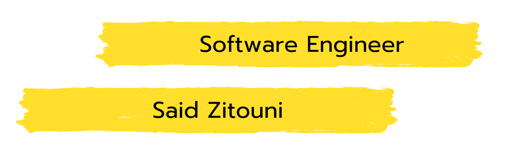

<h4 align="center">I am Said ZITOUNI, I speak 4 languages : English, French, Arabic and Turkish. Since being a kid, I enjoyed troubleshooting and solving issues related to software or hardware, which combined with my curiosity led me to find my way into the world of programming. Currently, I am enrolled in a Full Stack Java Developer Bootcamp at Per Scholas and expected to graduate by the end of June.   
 </h4>
 

## 🔥 Streak Stats

