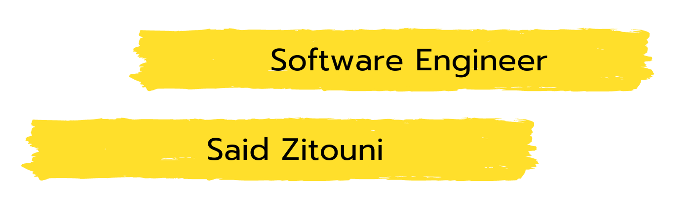

<h1 align="center">Hi 👋, I'm Said Zitouni</h1>
<h3 align="center">A passionate software Engineer</h3>

- 🔭 I'm a Software Engineer, Vibe coder and Environmental Science Graduate.
- ⚡ Fun fact **I like and collect** ✏️ **pens**

## 🔥 Streak Stats

## 🛠️ Technologies & Tools

### 💻 Backend Technologies

    
    
    
    
    
    
    
    

### 🌐 Frontend Technologies

    
    
    
    
    
    
    

### ☁️ Cloud & DevOps

    
    
    
    
    
    
    
    
    

### 🗄️ Databases

    
    
    
    

### 🧪 Testing Frameworks

    <a href="https://junit.org/junit5/" target="_blank" rel="noreferrer"> 
         
        JUnit
    </a>
    <a href="https://docs.pytest.org/" target="_blank" rel="noreferrer" style="margin-left:20px;"> 
         
        pytest
    </a>
    <a href="https://cucumber.io/" target="_blank" rel="noreferrer" style="margin-left:20px;"> 
        🥒
        Cucumber
    </a>
    <a href="https://xunit.net/" target="_blank" rel="noreferrer" style="margin-left:20px;"> 
         
        xUnit
    </a>
    <a href="https://pester.dev/" target="_blank" rel="noreferrer" style="margin-left:20px;"> 
         
        Pester
    </a>

### 🛡️ Code Quality & Security

    
    
    
    <a href="https://aquasecurity.github.io/trivy/" target="_blank" rel="noreferrer"> 🔍 Trivy </a>

### 🤖 AI Tools & Frameworks

    <a href="https://www.langchain.com/" target="_blank" rel="noreferrer"> 🦜⛓️ LangChain </a>
    <a href="https://spring.io/projects/spring-ai" target="_blank" rel="noreferrer" style="margin-left:20px;"> 🤖 Spring AI </a>
    <a href="https://github.com/features/copilot" target="_blank" rel="noreferrer" style="margin-left:20px;"> 🛠️ GitHub Copilot </a>
    <a href="https://cursor.sh/" target="_blank" rel="noreferrer" style="margin-left:20px;"> ⚡ Cursor </a>
    <a href="https://kiro.so/" target="_blank" rel="noreferrer" style="margin-left:20px;"> 🤖 Kiro </a>
    <a href="https://github.com/block/goose" target="_blank" rel="noreferrer" style="margin-left:20px;"> 🪿 Goose </a>
    <a href="https://github.com/ggerganov/llama.cpp" target="_blank" rel="noreferrer" style="margin-left:20px;"> 🦙 Llama.cpp </a>
    <a href="https://ollama.ai/" target="_blank" rel="noreferrer" style="margin-left:20px;"> 🦙 Ollama </a>

#### 🧠 Prompting Techniques
- Few-shot prompting
- Chain-of-thought reasoning  
- Retrieval-augmented generation (RAG)
- Prompt engineering & optimization

 

### 🌐 Operating Systems

    
    
    
    

## 📈 Most Used Languages

  

